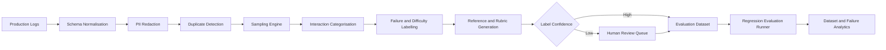

# ⛏️ Production Log Eval Miner

### Converting Real Interaction Failures into Curated LLM Evaluation Datasets

**A data pipeline that transforms anonymised production interactions into reusable, reviewable evaluation cases.**

---

## Overview

The Production Log Eval Miner extracts high-value evaluation examples from application logs.

Raw interactions are normalised, redacted, deduplicated, sampled using multiple strategies, categorised, assigned difficulty levels, and converted into structured evaluation cases with reference answers and scoring rubrics.

Low-confidence labels are routed to a human-review queue, while approved examples become part of a growing regression dataset.

## Architecture

## Core Capabilities

| Capability | Description |
|---|---|
| Log ingestion | Accepts structured production interaction records |
| Schema normalisation | Converts heterogeneous logs into a consistent format |
| PII redaction | Removes email addresses, telephone numbers, and sensitive patterns |
| Exact deduplication | Removes repeated interactions |
| Semantic deduplication | Detects near-identical evaluation candidates |
| Random sampling | Preserves general production distribution |
| Stratified sampling | Balances categories and difficulty levels |
| Signal-based sampling | Prioritises failures, low ratings, retries, and anomalies |
| Interaction categorisation | Groups examples by task and failure type |
| Difficulty labelling | Assigns easy, medium, or hard classification |
| Reference generation | Produces an expected answer or correction |
| Rubric generation | Creates reusable evaluation criteria |
| Human review queue | Routes uncertain examples for confirmation |
| Regression execution | Tests current model behaviour against the mined dataset |

## Evaluation Case Model

Each approved case can contain:

- stable evaluation identifier;
- redacted input;
- original model output;
- expected or corrected output;
- task category;
- failure category;
- difficulty;
- scoring rubric;
- source signals;
- label confidence;
- review status;
- provenance metadata.

## Engineering Highlights

- JSONL log ingestion
- Configurable redaction pipeline
- Exact and semantic duplicate detection
- Random and stratified sampling
- Failure-signal prioritisation
- Automated reference construction
- Confidence-based review routing
- Human correction workflow
- Regression dataset versioning
- Scheduled pipeline support
- FastAPI review service
- Dataset and failure analytics

## Technology Stack

| Layer | Technology |
|---|---|
| Processing | Python |
| API | FastAPI |
| Validation | Pydantic |
| Storage | SQLite, JSON, and JSONL |
| Similarity | Embeddings and semantic matching |
| Scheduling | Scriptable pipeline workflow |
| Deployment | Docker |
| Testing | Pytest |

## Design Principles

1. Production failures are valuable evaluation data.
2. Privacy redaction must occur before downstream processing.
3. Sampling should balance realism with difficult and high-value cases.
4. Automatic labels require confidence estimates and human review.
5. Dataset provenance should remain traceable.

## Security and Privacy

- Production logs must be anonymised before evaluation mining.
- Raw logs should not be committed to source control.
- Redaction rules should be expanded for domain-specific identifiers.
- Access to original interactions should follow least-privilege policies.
- External providers should only receive approved and redacted content.

## License

This project is licensed under the [MIT License](LICENSE).

**Production Log Eval Miner — converting real failures into measurable future safeguards.**

