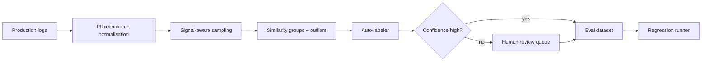

<div align="center">

# Production Log Eval Miner

### Continuously convert real interaction patterns into curated evaluation cases

[](https://www.python.org/)
[](https://fastapi.tiangolo.com/)
[](https://www.docker.com/)
[](LICENSE)

</div>

---

## Overview

Normalises LLM interaction logs, redacts common PII patterns, samples high-signal failures, assigns categories and difficulty, creates reference/rubric labels, deduplicates near-identical cases, routes low-confidence labels to review, and runs a simple regression evaluation.

## Core capabilities

| Capability | Implementation |
|---|---|
| Log ingestion | JSONL schema normalisation and SHA-256 deduplication. |
| Privacy | Email and phone redaction before persistence. |
| Sampling | Random, stratified, and negative-signal prioritisation. |
| Interaction labels | Category, difficulty, expected behaviour, quality, and confidence. |
| Curation queue | Automatic approval for high-confidence labels; review for the rest. |
| Regression tracking | Stored evaluation runs and pass-rate history. |

## Architecture



## Quick start on Windows

```powershell
py -3.11 -m venv .venv
.\.venv\Scripts\Activate.ps1
python -m pip install --upgrade pip
pip install -e ".[dev,dashboard]"
Copy-Item .env.example .env
pytest -q
eval-miner ingest data/production_logs.jsonl
eval-miner mine --limit 200
eval-miner evaluate
eval-miner serve
```

API documentation: `http://localhost:8613/docs`

## Docker

```powershell
Copy-Item .env.example .env
docker compose up --build
```

## Safety and data handling

- The default mode is offline and uses synthetic sample data.
- Put provider keys only in `.env` or GitHub repository secrets.
- Do not commit training checkpoints, production logs, private documents, or user data.
- Run `pytest -q` before every push.

Run `python scripts/nightly.py` to simulate the scheduled end-to-end pipeline on 240 synthetic production interactions.

## GitHub

See [GITHUB_SETUP.md](GITHUB_SETUP.md) and [DAILY_COMMIT_PLAN.md](DAILY_COMMIT_PLAN.md).

## License

[MIT](LICENSE)
